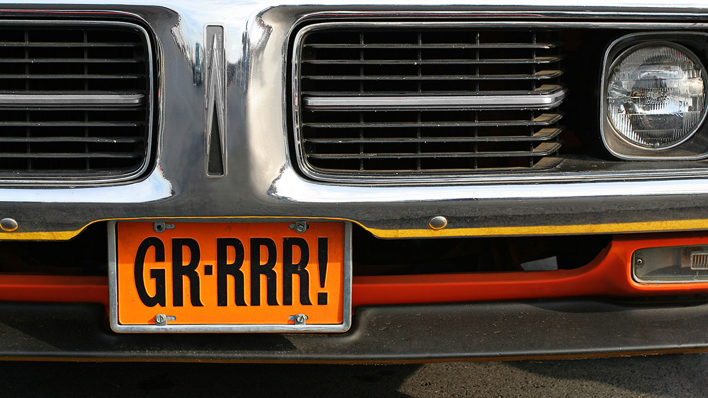

# License Plate Detection - Microservices



**Automatic Number Plate Recognition** (ANPR) is the process of reading the characters on the plate with various **optical character recognition** (OCR) methods by separating the plate region on the vehicle image obtained from automatic plate recognition.

This repository forks the [Automatic_Number_Plate_Recognition_YOLO_OCR
](https://github.com/mftnakrsu/Automatic_Number_Plate_Recognition_YOLO_OCR) one by [mftnakrsu](https://github.com/mftnakrsu) to extract the license plate detection methods and create a microservices deployable as Docker containers.

## Dataset

The dataset used in the dataset folder for license plate detection:

https://www.kaggle.com/datasets/andrewmvd/car-plate-detection

## How to build

Build the image using the Docker command.

```bash
docker build -t platedetection .
```

Alternativelly, use the _build.sh_ script.

```bash
chmod +x build.sh
./build.sh
```

## How to run

Run the image as following.

```bash
docker run -d --name platedetection -p 8080:8080\
    -v /var/log/platedetection:/opt/app/log \
    -v ~/static-files:/opt/app/static-files \
    platedetection
```

Alternativelly, use the _run.sh_ script.

```bash
chmod +x run.sh
./run.sh
```

## Output folder

The current output folder is the following:

```bash
cd static-files/detected-license-plate
```

# Use sample data

```bash
./upload-file.sh sample-data/test.jpg localhost 8080
```

## How to read the logs

The filename is custom and it can be modified in the configuration file.

```bash
tail -f /var/log/lcarnevale/license-plate-detection.log
```
